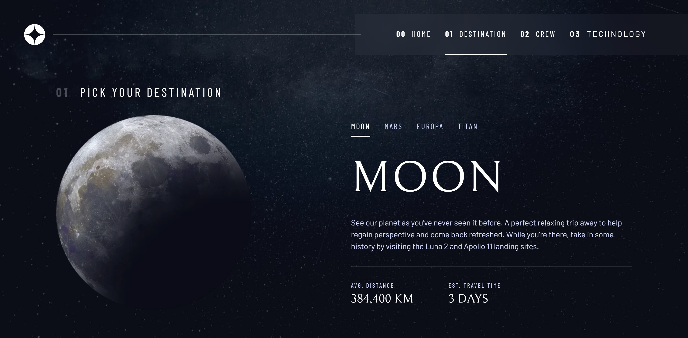

# Frontend Mentor - Space tourism website solution

This is a solution to the [Space tourism website challenge on Frontend Mentor](https://www.frontendmentor.io/challenges/space-tourism-multipage-website-gRWj1URZ3). Frontend Mentor challenges help you improve your coding skills by building realistic projects.

## Table of contents

- [Frontend Mentor - Space tourism website solution](#frontend-mentor---space-tourism-website-solution)
  - [Table of contents](#table-of-contents)
  - [Overview](#overview)
    - [The challenge](#the-challenge)
    - [Screenshot](#screenshot)
    - [Links](#links)
  - [My process](#my-process)
    - [Built with](#built-with)
    - [What I learned](#what-i-learned)
    - [Continued development](#continued-development)
    - [Useful resources](#useful-resources)
  - [Author](#author)

## Overview

### The challenge

Users should be able to:

- View the optimal layout for each of the website's pages depending on their device's screen size
- See hover states for all interactive elements on the page
- View each page and be able to toggle between the tabs to see new information

### Screenshot



### Links

- Solution URL: [View Repository](https://github.com/pHoeniX-svg/space-tourism-fm)
- Live Site URL: [View Site](https://space-tours-fm.netlify.app/)

## My process

### Built with

- Semantic and Accessible HTML5 markup
- CSS custom properties
- Flexbox
- CSS Grid
- Mobile-first workflow
- [Typescript](https://www.typescriptlang.org/) - **JavaScript** with syntax for types
- [Sass](https://sass-lang.com/) - CSS Preprocessor
- [ViteJS](https://github.com/vitejs/vite) - Modern Javascript Module Bundler

### What I learned

```html
<button
  class="text-white ff-serif fs-600"
  role="tab"
  aria-selected="false"
  aria-controls="spaceport-tab"
  data-image="spaceport-image"
  tabindex="-1"
>
  <span class="sr-only">spaceport</span>
  <span aria-hidden="true">2</span>
</button>
```

```scss
@each $screen-size, $property in $type-scale {
  @if $screen-size == small {
    @each $prop, $value in $property {
      .fs-#{$prop} {
        font-size: var(--fs-#{$prop});
      }
    }
  }
}
```

```ts
function getElement<T extends Element>(
  selector: string,
  scope: ParentNode | Document
): T;
function getElement<T extends Element>(
  selector: string,
  scope: ParentNode | Document,
  isElementArray: true
): T[];
function getElement<T extends Element>(
  selector: string,
  scope: ParentNode | Document,
  isElementArray: false
): T;
function getElement<T extends Element>(
  selector: string,
  scope: ParentNode | Document,
  isElementArray?: boolean
): T | T[] {
  try {
    if (isElementArray) {
      const element = [...scope.querySelectorAll(selector)] as T[];
      if (element.length < 1) throw Error;
      return element;
    } else {
      const element = scope.querySelector(selector) as T;
      if (!element) throw Error;
      return element;
    }
  } catch (e) {
    throw new Error(
      `There is an error. Please check if your selector: ${selector} is correct`
    );
  }
}
```

### Continued development

- Semantic and Accessible HTML5 markup
- Mobile first workflow
- Building Design Systems
- Working with TypeScript

### Useful resources

- [MDN: CSS Grids Layout](https://developer.mozilla.org/en-US/docs/Learn/CSS/CSS_layout/Grids) - This is an amazing article which helped me finally understand CSS Grid Layouts. I'd recommend it to anyone still learning this concept.

## Author

- Frontend Mentor - [@pHoeniX-svg](https://www.frontendmentor.io/profile/pHoeniX-svg)
- Twitter - [@princemuel_cs](https://twitter.com/princemuel_cs)
- Github - [@pHoeniX-svg](https://github.com/pHoeniX-svg/)
